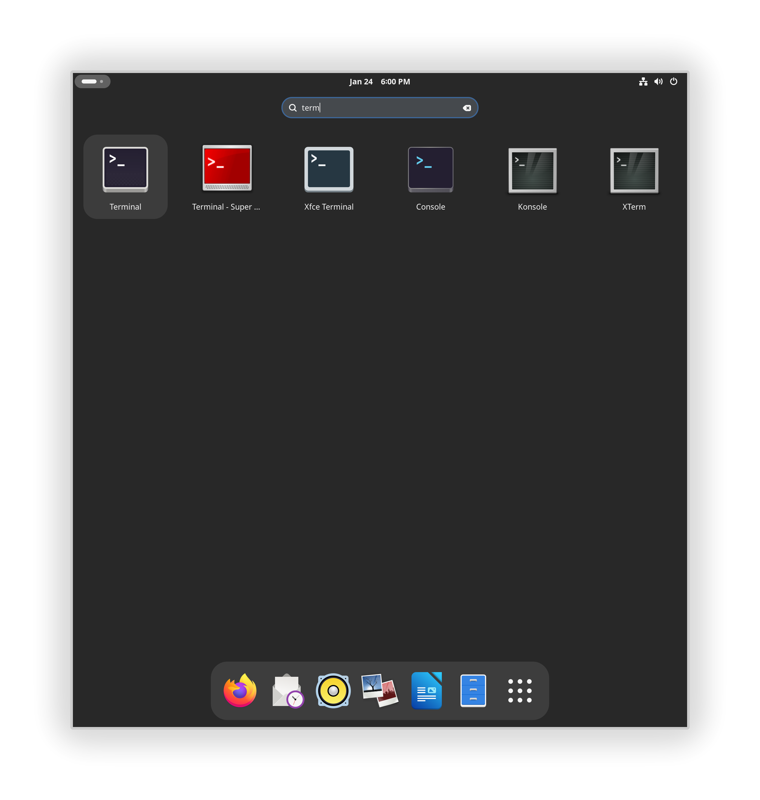

# Tidy Menus

Most desktop environments provide core applications such as a terminal, file manager and text editor. These provide much the same functionality as counterpart applications on other desktop environments, but can clutter up menus with seemingly redundant applications.

For example, with GNOME, KDE and Xfce installed, there are six file manager **(first image, KDE shown)** and six terminal **(second image, GNOME shown)** applications available. Mending Wall will tidy these to only show each in its native desktop environment. The idea is that you will use Console or Terminal on GNOME and Cinnamon, Konsole on KDE, and Xfce Terminal on Xfce.

{width=400}{width=400}
/// caption
The KDE menu showing six file manager applications
///

{width=400}
/// caption
The GNOME menu showing six terminal applications
///

Mending Wall tidies them up, organizing your menus to only display the core applications of your current desktop environment. To have Mending Wall automate the process, enable its *Tidy Menus* feature.

!!! tip
    You can also use an app like [Libre Menu Editor](https://flathub.org/apps/page.codeberg.libre_menu_editor.LibreMenuEditor) to make manual changes (or refine Mending Wall's changes), or edit `.desktop` files directory.


## What it does

*Tidy Menus* applies rules to applications such that they only show in the menu of their native desktop environment. The rules are generally consistent with the model that you, the user, will always prefer a native app over a non-native app, all else being equal. So you will use Console, Nautilus and Text Editor on GNOME, but Konsole, Dolphin and Kate on KDE Plasma. The rules apply mostly to core applications with counterparts in other desktop environments. Exceptions are made for larger applications that are too sophisticated to be considered counterparts, despite having similar aims, such as GIMP and Krita. The rules only affect visibility in menus; all applications are still available in all desktop environments and can be launched by other means (such as from the command line).

You may disagree with some of the rules. For example, Document Viewer on GNOME and Okular on KDE Plasma are considered counterparts, but Okular provides more PDF annotation features and you may like to see it in GNOME also. In such cases the Main Menu application is recommended for customization. Mending Wall will not override customizations made with Main Menu or otherwise. The recommended approach is to enable *Tidy Menus* in Mending Wall to automate the process as much as possible, and Main Menu for further refinement where necessary.


## How it works

!!! info
    This section is for users who want to know exactly what Mending Wall is doing to their system.

When *Tidy Menus* is enabled, Mending Wall starts a background process named `mendingwall-menus` that will also restart every time you log in. This process applies the menu rules, and reapplies them when new applications are installed.

Specifically, it acts as follows:

1. It considers all `.desktop` files installed in the `applications` subdirectory of any directories listed in the `XDG_DATA_DIRS` environment variable.

2. For each `.desktop` file it determines, according to its rules, whether the `OnlyShowIn` or `NotShowIn` keys should be updated.

3. If so, it copies the `.desktop` file into `$XDG_DATA_HOME/applications/` and updates those keys. If a `.desktop` file for the application already exists in `$XDG_DATA_HOME/applications/`, it is not changed (in this way, customizations made with Main Menu or otherwise are not overwritten). If `XDG_DATA_HOME` does not exist then the default value `$HOME/.local/share` is assumed.

4. It continues to monitor for changes to any of the directories listed in `XDG_DATA_DIRS`. When changes occur it reapplies the rules. For example, if a new application is installed, one or more `.desktop` files will be written in these directories, and subject to the rules.

## Configuration

!!! info
    This section is for contributors to help improve Mending Wall. The installed rules are meant to be suitable for everyone, with adjustments made with other apps, such as Main Menu.

The rules applied by *Tidy Menus* are set in the config file `menus.conf`. If the environment variable `XDG_CONFIG_HOME` is set then `$XDG_CONFIG_HOME/mendingwall/` is checked for the file, otherwise the default directory `$HOME/.config/mendingwall/` is checked. If the file is not found, the directories listed in `XDG_CONFIG_DIRS` are checked in order, adding a subdirectory `mendingwall/` to each, until the file is first found.

If `menus.conf` is in a system directory and you wish to make changes to it, first copy it into `$XDG_CONFIG_HOME/mendingwall/` or `$HOME/.config/mendingwall/`.

The config file is in the [KeyFile](https://docs.gtk.org/glib/struct.KeyFile.html) format. It contains any number of group headers to identify applications, each followed by key-value pairs that specify the desktop environments in which to show that application. For example:
```
[org.kde.Konsole]
OnlyShowIn=KDE

[org.gnome.Console]
OnlyShowIn=GNOME;X-Cinnamon
```

The group headers are surrounded by square brackets (`[...]`) and identify the applications. Each should be the name of the `.desktop` file of the application, but without the `.desktop` extension. The names are usually, but not always, reverse domain-name identifiers (e.g. they start with `org.gnome.` or `org.kde.`).

Each key is followed by an equals sign (`=`), and where multiple values are required they are separated by semicolons (`;`). Recognized keys are:

| Key | Description |
| --- | ----- |
| `OnlyShowIn` | The application will only be shown in these desktop environments. |
| `NotShowIn` | The application will be shown in all but these desktop environments. |

It only makes sense to use one of these. They are copied into the `.desktop` file of the application. Valid values are the same as those that appear in the `XDG_CURRENT_DESKTOP` environment variable set by desktop environments, e.g. `GNOME` and `KDE`. These are case sensitive.


## Relevant specifications

* The [XDG Base Directory Specification](https://specifications.freedesktop.org/basedir-spec/latest/) for the `XDG_CONFIG_HOME`, `XDG_CONFIG_DIRS`, `XDG_DATA_HOME`, and `XDG_DATA_DIRS` environment variables.
* The [XDG Desktop Entry Specification](https://specifications.freedesktop.org/desktop-entry-spec/latest/) for `.desktop` files, especially the [Recognized desktop entry keys](https://specifications.freedesktop.org/desktop-entry-spec/latest/recognized-keys.html) section for interpretation of the `OnlyShowIn` and `NotShowIn` keys and related `XDG_CURRENT_DESKTOP` environment variable.
* The [XDG Desktop Menu Specification](https://specifications.freedesktop.org/menu-spec/latest/) and especially [Registered OnlyShowIn environments](https://specifications.freedesktop.org/menu-spec/latest/onlyshowin-registry.html).
