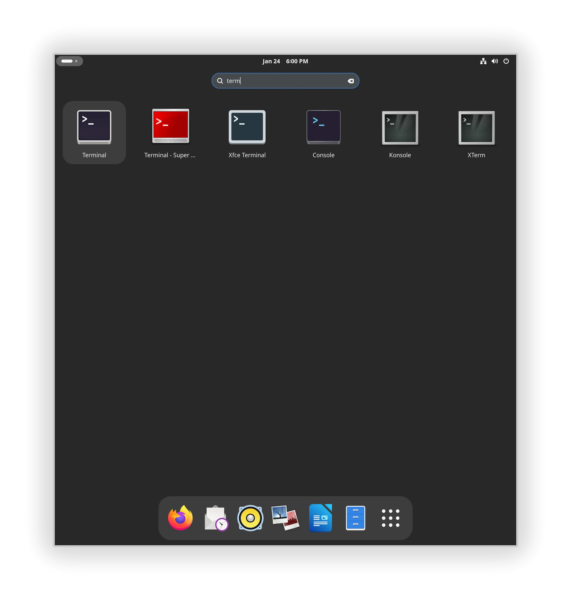

# Tidy Menus

Most desktop environments provide core applications such as a terminal, file manager and text editor. These provide much the same functionality as counterpart applications in other desktop environments, but can clutter up menus with seemingly redundant applications.

{width=400}{width=400}
/// caption
With GNOME, KDE and Xfce installed, the KDE menu shows six file manager applications.
///

{width=400}
/// caption
Simlarly, the GNOME dash shows six terminal applications.
///

To have Mending Wall tidy up menus automatically, enable its *Tidy Menus* feature. It will then show core applications in the menu for their respective desktop environment only.

## What it does

*Tidy Menus* applies a set of rules to show certain applications in their native desktop environment only. It does not apply to all applications. The rules are generally consistent with the notion that you, the user, will always prefer a native app over a non-native app. So you will use Console, Nautilus and Text Editor on GNOME, but Konsole, Dolphin and Kate on KDE Plasma.

The rules apply mostly to core applications with counterparts in other desktop environments, as well as many games. They do not apply to larger applications that are too featureful to be considered counterparts, despite having similar aims, such as GIMP and Krita. The rules only affect visibility in menus; all applications are still available in all desktop environments and can be launched by other means (such as from the command line).

!!! tip
    You can also use an app like [Libre Menu Editor](https://flathub.org/apps/page.codeberg.libre_menu_editor.LibreMenuEditor) to change menus, or edit `.desktop` files directly. Mending Wall will not override changes made with other apps. The recommended approach is to enable *Tidy Menus* in Mending Wall to automate the process as much as possible, then use another app for refinement if necessary.


## How it works

!!! info
    This section is for users who want to know exactly what Mending Wall is doing to their system.

When *Tidy Menus* is enabled, Mending Wall starts a background process named `mendingwalld` that will also auto-start every time you log in. This process applies the menu rules, and reapplies them when new applications are installed. When *Tidy Menus* is disabled, it will undo any changes.

The process acts as follows:

1. It considers all `.desktop` files installed in the `applications` subdirectory of any directories listed in the `XDG_DATA_DIRS` environment variable (e.g. `/usr/share/applications`, `/usr/local/share/applications`).

2. For each `.desktop` file it determines, according to its rules, whether the `OnlyShowIn` or `NotShowIn` keys should be updated.

3. If so, it copies the `.desktop` file into `$XDG_DATA_HOME/applications/` and updates those keys. It also adds an entry `X-MendingWall-Tidied=true` for record keeping, in case *Tidy Menus* is disabled in future and changes must be undone. If a `.desktop` file for the application already exists in `$XDG_DATA_HOME/applications/`, it is not changed (in this way, customizations made with other apps are not overwritten). If the environment variable `XDG_DATA_HOME` does not exist then the default value `$HOME/.local/share` is used.

4. It continues to monitor for changes to any of the directories listed in `XDG_DATA_DIRS`. When changes occur it reapplies the rules. For example, if a new application is installed, one or more new `.desktop` files will appear in these directories and be subject to the rules.

## Configuration

!!! info
    This section is for contributors to help improve Mending Wall. The installed rules are meant to be suitable for everyone, with adjustments made with other apps.

The rules applied by *Tidy Menus* are set in the config file `menus.conf`. If the environment variable `XDG_CONFIG_HOME` is set and `$XDG_CONFIG_HOME/mendingwall/menus.conf` exists then that file is used, otherwise `$HOME/.config/mendingwall/menus.conf`, otherwise the directories listed in `XDG_CONFIG_DIRS` are checked in order for `mendingwall/menus.conf` until the file is found.

If `menus.conf` is in a system directory and you wish to make changes to it, first copy it to `$XDG_CONFIG_HOME/mendingwall/menus.conf` or `$HOME/.config/mendingwall/menus.conf`.

The config file is a [KeyFile](https://docs.gtk.org/glib/struct.KeyFile.html). It contains any number of group headers to identify applications, each followed by key-value pairs that specify the desktop environments in which to show that application. For example:
```
[org.kde.Konsole]
OnlyShowIn=KDE

[org.gnome.Console]
OnlyShowIn=GNOME;X-Cinnamon
```

The group headers are surrounded by square brackets (`[...]`) and identify the applications. Each should be the name of the `.desktop` file of the application, but without the `.desktop` extension. The names are usually, but not always, reverse domain-name identifiers (e.g. they start with `org.gnome.` or `org.kde.`).

Each key is followed by an equals sign (`=`), and where multiple values are required they are separated by semicolons (`;`). Recognized keys are:

| Key | Description |
| --- | ----- |
| `OnlyShowIn` | The application will only be shown in these desktop environments. |
| `NotShowIn` | The application will be shown in all but these desktop environments. |

It only makes sense to use one of these. They are copied into the `.desktop` file of the application. Valid values are the same as those that appear in the `XDG_CURRENT_DESKTOP` environment variable set by desktop environments, e.g. `GNOME` and `KDE`. These are case sensitive.


## Relevant specifications

* The [XDG Base Directory Specification](https://specifications.freedesktop.org/basedir-spec/latest/) for the `XDG_CONFIG_HOME`, `XDG_CONFIG_DIRS`, `XDG_DATA_HOME`, and `XDG_DATA_DIRS` environment variables.
* The [XDG Desktop Entry Specification](https://specifications.freedesktop.org/desktop-entry-spec/latest/) for `.desktop` files, especially the [Recognized desktop entry keys](https://specifications.freedesktop.org/desktop-entry-spec/latest/recognized-keys.html) section for interpretation of the `OnlyShowIn` and `NotShowIn` keys and related `XDG_CURRENT_DESKTOP` environment variable.
* The [XDG Desktop Menu Specification](https://specifications.freedesktop.org/menu-spec/latest/) and especially [Registered OnlyShowIn environments](https://specifications.freedesktop.org/menu-spec/latest/onlyshowin-registry.html).
